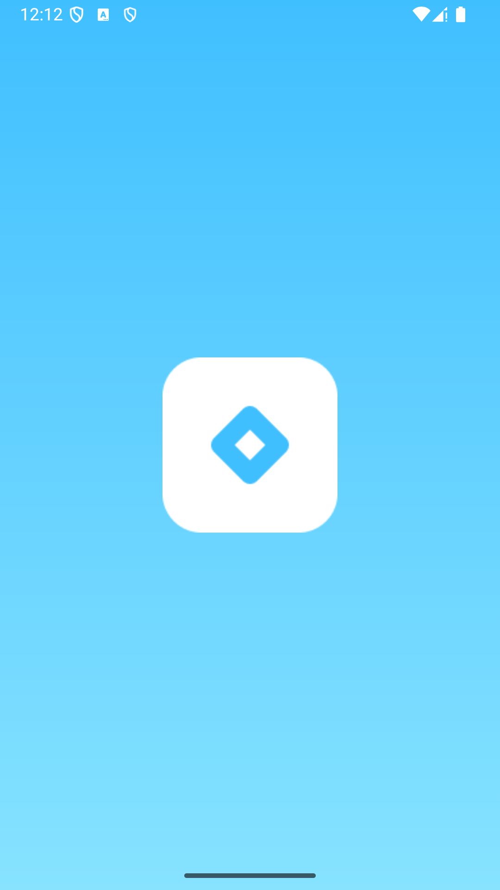
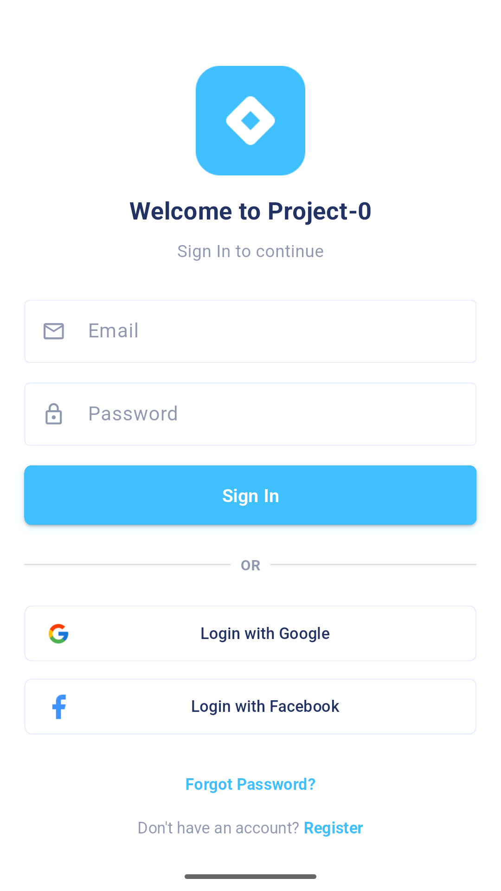
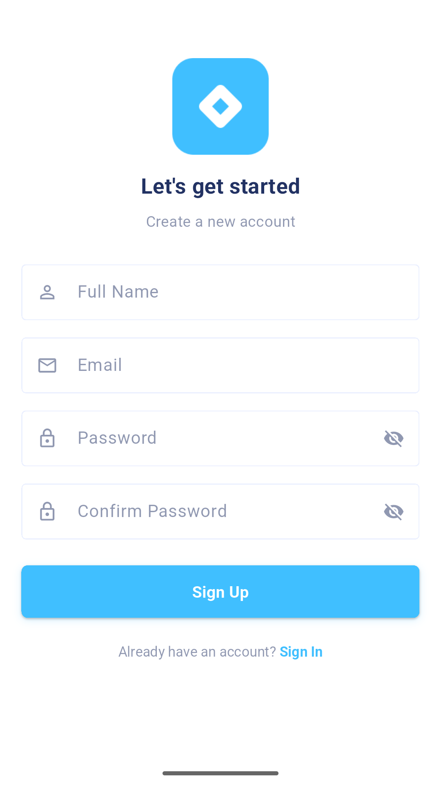

### Navigate to project
cd project-zero

### Install dependencies
flutter pub get

### Configuration
- Enable authentication providers in backend
- Add web client IDs for Google Sign-In
- Configure Facebook App ID in Info.plist and build.gradle

### Folder Structure 📁
```
lib/
├── core/
│   ├── constants/
│   ├── services/
│   ├── utils/
│   └── widgets/
├── features/
│   ├── auth/
│   │   ├── presentation/
│   │   │   ├── screens/
│   │   │   └── widgets/
│   │   ├── domain/
│   │   └── data/
│   ├── reels/
│   ├── chat/
│   └── admin/
├── firebase/
└── main.dart
```


#### Flutter App Screenshots

<table>
  <tr>
    <td>Splash Screen</td>
     <td>Login Screen</td>
     <td>Register Screen</td>
  </tr>
  <tr>
    <td></td>
    <td></td>
    <td></td>
  </tr>
 </table>

### Roadmap 🗺️
- Backend Auth Integration
- Reels Video Player
- Creator Upload Flow
- Chat System
- Admin Dashboard
- Payment Gateway

### Contributing 🤝
- Fork the repository
- Create feature branch: git checkout -b feature/your-feature
- Commit changes: git commit -m 'Add your feature'
- Push to branch: git push origin feature/your-feature
- Open Pull Request


